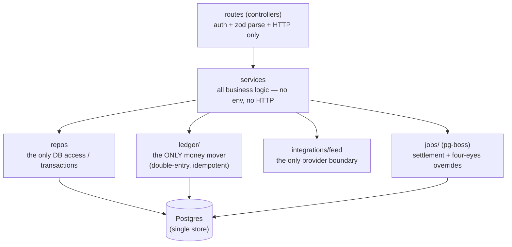
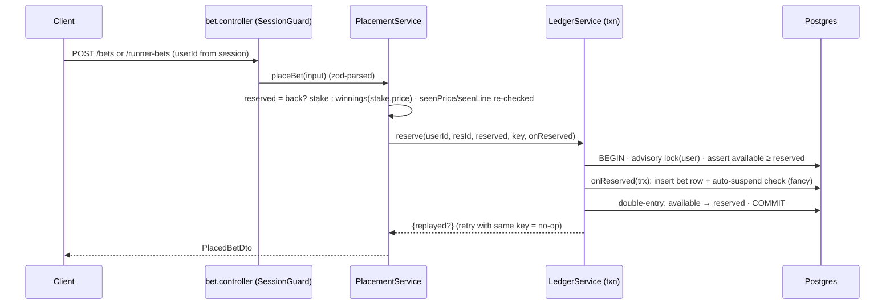
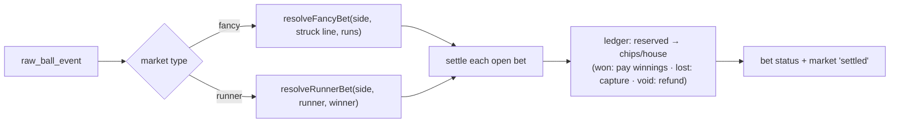
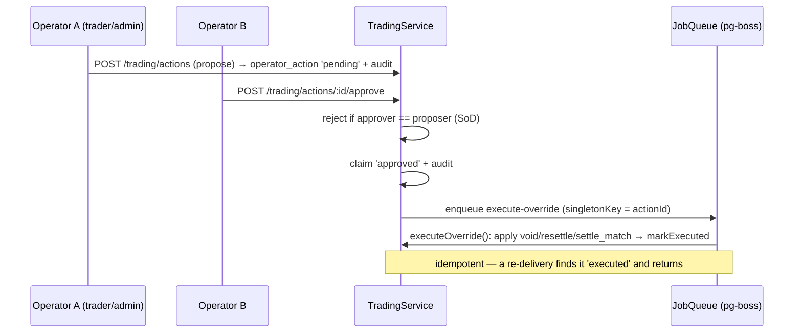

# casino-royale — "Kestrel"

A **play-money virtual cricket betting exchange**. Repo: `casino-royale`; the UI brands itself **Kestrel**.
No real money in or out — bets are placed with **virtual credits** that have no cash value (**D32/D33**).

Operator-priced cricket markets — **match-odds**, **bookmaker**, **fancy/session**, and **ball-by-ball** —
sit on a **double-entry chip ledger** in a single Postgres store. Every balance shown or used in a decision
is derived from ledger entries, never a cached column.

> This README is generated from the code as it stands and every figure below was verified against the
> repository (test counts by running the suites, routes/tables by reading the source). The authoritative
> "why" lives in [`docs/DECISIONS.md`](docs/DECISIONS.md) (D1–D52); the current state in
> [`docs/STATE.md`](docs/STATE.md); the binding working contract in [`CLAUDE.md`](CLAUDE.md).

---

## Status (verified)

| | |
|---|---|
| Backend tests | **161 passing** across **29 suites** (`pnpm test`, real Postgres) |
| Frontend tests | **11 passing** across **3 files** (`cd web && pnpm test`, vitest) |
| Backend source | ~4,400 LOC TypeScript (excl. specs) |
| Product state | Play-money cricket product is **feature-complete against the Phase-2 plan (PC1–PC5)** and has passed **two adversarial audits** (D47, D50) + a screen-numbers review (D51) |
| Money display | **Credits** — integer, no decimals, no fiat symbol (D52). 1 credit = 1 stored chip |
| **Not built** | Real external cricket feed · casino (2nd engine) · real-money track (KYC/AML/RG/payments/licensing) |

---

## Tech stack

**Backend** — NestJS 10.4 on the **Fastify** adapter · **Kysely** 0.27 query builder over **Postgres**
(`pg` 8.13) · **zod** 3.23 (config) · **nestjs-pino** / `pino-http` (logging) · **pg-boss** 9.0 (durable
jobs) · **rxjs** 7.8 (in-process live bus). Tooling: **Jest** 29 + ts-jest · **fast-check** 4 (property
tests) · **ESLint** 8 + `eslint-plugin-local-rules` (custom money guardrails) · **dependency-cruiser** 16
(layer boundaries). `pnpm@9.12`, Node ≥ 20.11.

**Frontend** (`web/`) — **React 18** + **Vite 5** + TypeScript 5.6 · **@tanstack/react-query** 5 · **react-router-dom** 6 · **vitest** 2 + Testing Library.

Money is **integer chips** end to end (no float, lint-enforced); odds are **scaled integers**
(`PRICE_SCALE = 10000`, e.g. `1.95 → 19500`).

---

## Repository layout

```
src/
  main.ts                     bootstrap — Nest + Fastify + pino + shutdown hooks
  app.module.ts               composition root: Config · Logger · Health · Ledger · Identity · Cricket · Trading
  health/                     GET /health
  shared/
    config/                   the ONLY reader of env — zod-parsed at boot (config.schema.ts)
    money/                    Chips = integer (bigint); arithmetic; no floats
    odds/                     scaled-integer price + winnings (ceil, customer's favour)
  ledger/                     the ONLY authority on chips — double-entry, append-only (core.ts + ledger.service.ts)
  db/                         Kysely connection + idempotent DDL (db.ts) + schema types + Executor
  jobs/                       JobQueue over pg-boss; inline fallback when JOBS_ENABLED=false
  integrations/feed/          CricketFeed interface + FixtureFeed (dev/CI). No live adapter.
  features/
    identity/                 accounts, sessions, password, rate-limit, roles, account+bonus
    cricket/                  markets · pricing · placement · exposure · settlement · live ticker · SSE
    trading/                  operator console — four-eyes overrides, integrity, risk reads
    audit/                    the one append-only audit_log writer
  jobs/ · tools/ · test/      job queue · custom lint rules · cross-cutting guardrail meta-test
web/src/                      React SPA (pages, components, lib)
docs/                         STATE · DECISIONS · PLAN · ARCHITECTURE · MILESTONES · CRICKET-MVP · REVIEW-FINDINGS · HARDENING-FINDINGS
.dependency-cruiser.cjs       layer + boundary rules   ·   eslint-local-rules.js  money guardrails
CLAUDE.md                     the binding working contract   ·   PRD.md  the (real-money) product spec (reference)
```

---

## Architecture

Strict, lint-enforced layering. Cross-feature access goes only through a feature's `index.ts`; nothing
outside `ledger/` moves money; only `integrations/` calls a provider; only `shared/config` reads env.



**Load-bearing invariants** (CLAUDE.md §4, enforced in code + tests):

- **The chip ledger is the only authority on chips** — double-entry, append-only, balanced. Corrections are
  new compensating entries; nothing is ever updated or deleted. Any shown balance is *derived* from entries.
- **State and chips live in one Postgres store** — a bet placement or settlement is a **single ACID
  transaction** (D44); a bet can never be recorded-but-unfunded. The domain-row write runs as a hook *inside*
  the ledger's transaction.
- **Every chip-affecting operation is idempotent by key** — a retried request is a no-op returning the first
  result, never a second movement.
- **No negative balance, ever** — a bet reserves against currently-available chips only; enforced in the
  ledger, not the UI.
- **Settlement is append-only and replayable** — raw ball events are stored as received; any settlement can be
  recomputed from them. Each bet settles atomically.
- **The feed proposes; the platform disposes** — no external input mutates a balance or settles a market
  directly.
- **Slow work goes in a table** — settlement runs and approved four-eyes overrides are pg-boss jobs.

**Single-owner rules** (CLAUDE.md §5 — exactly one implementation each): money movement (one ledger client) ·
customer exposure (`calculateCustomerExposure`) · operator liability (`calculateOperatorLiability`) ·
the odds/price constructor · money formatting (one formatter) · idempotency · authorization
(`SessionGuard` / `RolesGuard`) · settlement resolvers.

> **Cricket-first, sport-additive (D48).** Cricket is the only sport; the money spine is sport-agnostic. A 2nd
> sport is a feature module, not a rewrite. Three known coupling points are the deliberate extraction seam
> (resolved at sport #2): `trading` importing cricket services, the HTTP filter mapping cricket errors, and the
> cricket-named tables.

---

## Data model (Postgres, 14 tables)

Defined as **idempotent DDL** in `src/db/db.ts` (`migrate()` runs `CREATE TABLE IF NOT EXISTS…`; no migration
tool yet). `int8` is parsed as `bigint` so chip amounts never lose precision.

| Table | Role |
|---|---|
| `ledger_txn` | one row per money transaction; carries the **unique idempotency key** |
| `ledger_entry` | double-entry lines (account, signed amount); **append-only** |
| `chip_reservation` | funds held for an open bet (`open`/`settled`/`released`) |
| `app_user` | accounts (email, password hash, status, role) |
| `user_session` | session tokens (sha-256 hashed), 7-day expiry |
| `audit_log` | append-only back-office trail (actor, action, subject, before/after) |
| `cricket_match` | matches + declared result |
| `raw_ball_event` | every delivery as received — the **settlement source of truth** |
| `market` | a market on a match (type + status `open`/`suspended`/`settled`) |
| `market_runner` | runner selections (match-odds / bookmaker / ball-by-ball) with prices |
| `fancy_market` | session market's struck line + back/lay prices |
| `market_config` | per-type runtime config (enabled, max stake, session threshold) |
| `bet` | placed bets (side, stake, reserved, potential_payout, struck line/runner, status) |
| `operator_action` | four-eyes overrides (kind, status, proposer, approver) |

---

## Core flows

### Bet placement — one ACID transaction (D44)

Reservation and the bet row commit together; the market status is re-checked under a row lock inside the same
transaction; for fancy markets the auto-suspend risk cap runs in-txn.



### Settlement — replayable from stored balls

Raw ball events drive pure resolvers (`resolveFancyBet`, `resolveRunnerBet`); each bet settles atomically
through the ledger. `void` returns stakes; `resettleFancyMarket` posts one compensating transaction. Exposure
and liability are computed by the single pure engine across the real resolutions (runner set, or the distinct
struck-line intervals for fancy — D50/H2).



### Four-eyes operator override (D45b)

A money-affecting override (`void` / `resettle` / `settle_match`) is **proposed by one operator and approved by
another** (segregation of duties). Approval enqueues a durable job; the override runs, then the action is marked
`executed` — never before. A startup re-drive recovers any approval whose job failed to persist (D50/L1).



### Live demo + push

`LiveTicker` (gated by `LIVE_TICK_MS > 0`, **refused in production**) drips one **generated** ball per tick,
reprices session lines, auto-settles due windows, and publishes on an in-process `rxjs` bus. `GET /matches/stream`
is a **Server-Sent Events** endpoint; the SPA keeps one `EventSource` and invalidates the affected React-Query
views (matches, score, balance, bets, leaderboard) on each tick, with slow polling as the fallback.

---

## HTTP API

`main.ts` mounts a global `DomainExceptionFilter` mapping zod → 400 and typed domain errors to their 4xx
(never a leaked 500). Money crosses the wire as **integer strings**.

**Public** (no auth)
| Method · Path | Purpose |
|---|---|
| `GET /health` | liveness |
| `GET /matches` | lobby list + match-odds top-of-book |
| `GET /matches/:id` | market view for a match |
| `GET /matches/:id/score` | per-innings score + current over |
| `GET /matches/stream` | **SSE** live updates |
| `POST /auth/signup` · `POST /auth/login` · `POST /auth/demo` · `POST /auth/logout` | identity (demo mints a funded throwaway account) |

**Session-authenticated** (`Authorization: Bearer <token>`)
| Method · Path | Purpose |
|---|---|
| `GET /me` · `GET /me/balance` · `GET /me/statement` | account + derived balance + ledger statement |
| `GET /me/bets` · `GET /leaderboard` | bet history (with P&L) · top players by settled net P&L |
| `GET /me/bonus` · `POST /me/bonus/claim` | daily bonus amount · claim (idempotent per UTC day) |
| `POST /me/change-password` | rotate password (revokes other sessions) |
| `POST /bets` · `POST /runner-bets` | place a fancy / runner bet (userId from session, never the body) |

**Operator** (`RolesGuard`, roles `trader`/`admin`)
| Method · Path | Purpose |
|---|---|
| `POST /trading/markets/:id/suspend` · `/reopen` | guarded status transitions (settled is terminal, D50/H1) |
| `POST /trading/actions` · `POST /trading/matches/:id/declare-result` | propose an override / a match result |
| `POST /trading/actions/:id/approve` · `/reject` | four-eyes decision |
| `GET /trading/actions` · `GET /trading/audit` | pending overrides · audit trail |
| `GET /trading/exposure/market/:id` · `/exposure/match/:id` · `GET /trading/integrity/market/:id` | risk reads |

---

## The cricket feed — what is and isn't wired

**Fact:** there is **no external cricket data API integrated.** No `fetch`/HTTP client for cricket data exists
in the backend.

- `src/integrations/feed/feed.ts` defines the **`CricketFeed`** port (`fixtures()`, `ballEvents()`, `health()`)
  and a `BallEvent` shape (per-delivery: runs, extras, wicket, legality, over/ball/innings).
- `FixtureFeed` supplies deterministic **recorded** data for dev/CI. A config tripwire **bans it in production**.
- `LiveTicker` (`features/cricket/live-ticker.service.ts`) **generates** balls with a probability table
  (`live.ts` `outcomeFromRoll`) — it is a demo, gated by `LIVE_TICK_MS`, and never runs in production.
- `FEED_SOURCE` accepts `fixture | cricbuzz`, but **`cricbuzz` has no implementation** — it is a placeholder.

To make it real, implement `CricketFeed` against a provider and select it by `FEED_SOURCE`. Options (researched,
not integrated): **[Cricsheet](https://cricsheet.org/)** (free, real ball-by-ball, but *historical* downloads —
ideal for replay), **CricAPI/cricketdata.org** (`match_bbb`; free tier 100/day, per-delivery only for major
matches), **Sportmonks/EntitySport/Roanuz** (paid live), **Sportradar / Stats Perform** (licensed — required for
any real-money product).

---

## Running locally

**Prerequisites:** Node ≥ 20.11, `pnpm@9.12`, and a local **Postgres** (default `localhost:5432`). The test
suite connects to a database named **`casino_royale_test`** — create it before running tests.

**Environment** (read once at boot, zod-validated — `src/shared/config/config.schema.ts`):

| Var | Default | Notes |
|---|---|---|
| `DATABASE_URL` | *(required)* | Postgres URL; missing = boot fails |
| `PORT` | `3000` | HTTP port |
| `LOG_LEVEL` | `info` | pino level |
| `NODE_ENV` | `development` | `production` forbids `FEED_SOURCE=fixture` |
| `FEED_SOURCE` | `fixture` | `cricbuzz` is unimplemented |
| `LIVE_TICK_MS` | `0` (off) | e.g. `6000` runs the demo ticker (never in prod) |
| `JOBS_ENABLED` | `false` | `false` runs jobs inline; `true` uses the pg-boss worker |

```bash
# Backend
pnpm install
DATABASE_URL=postgres://localhost:5432/casino_royale pnpm start:dev

# Live demo (generated balls tick on their own)
LIVE_TICK_MS=6000 DATABASE_URL=postgres://localhost:5432/casino_royale pnpm start:dev

# Frontend (Vite dev server; proxies /api → :3000)
cd web && pnpm install && pnpm dev

# Tests / full gate
DATABASE_URL=postgres://localhost:5432/casino_royale_test pnpm test     # backend (161)
pnpm check                                                              # typecheck · lint · boundaries · test
cd web && pnpm check                                                    # typecheck · lint · vitest · build
```

---

## Testing & guardrails

- **161 backend tests / 29 suites** (mostly real-Postgres integration) + **11 web tests**.
- **Property tests** via `fast-check` on the pure core (the ledger balances; no negative withdrawable balance;
  exposure/liability invariants).
- **Custom ESLint rules** (`eslint-local-rules.js`): `no-float-in-money` and `bounded-list-return` — a float in a
  money path or an unbounded list return fails CI.
- **dependency-cruiser** (`pnpm lint:boundaries`) enforces the layer/boundary rules above.
- A cross-cutting **guardrail meta-test** (`test/guardrails.spec.ts`) checks the rules themselves.

**Working process (CLAUDE.md §2):** every non-trivial change runs plan → review → adversarial review → code →
review → adversarial review. The codebase has been through **two full adversarial audits** — see
[`docs/HARDENING-FINDINGS.md`](docs/HARDENING-FINDINGS.md) (D50, 11 findings remediated) and D47.

---

## What's done

- **Money spine** — double-entry chip ledger; reservations; idempotency; no-negative; atomic placement (D44);
  replayable settlement; durable job queue (pg-boss, D45) with inline fallback.
- **Identity** — signup / login / demo / logout, hashed sessions (7-day), password rotation, rate-limited demo,
  roles.
- **Cricket markets** — match-odds, bookmaker, fancy/session, ball-by-ball; operator-priced; per-type runtime
  config (enable, max-stake, threshold).
- **Betting & settlement** — session-auth placement, single-owner exposure/liability (N-outcome + fancy
  struck-line-interval correct, D50/H2), fancy + runner settlement, void, fancy resettlement.
- **Operator console** — four-eyes void/resettle/settle_match (SoD + durable execute-then-mark + startup
  re-drive), suspend/reopen with a terminal-status guard (D50/H1), integrity flags, risk reads, append-only
  audit with before/after.
- **Live** — demo ticker (generated balls) + auto-settlement + **SSE** push; SPA refreshes on each tick.
- **Engagement** — daily bonus (idempotent/day), leaderboard (SQL-aggregated net P&L, non-PII handles).
- **Frontend** — React SPA: lobby, In-Play, Match, Ball-by-Ball, Account (balance/bets/statement/settings/bonus),
  Admin console, Leaderboard, Login/Demo; **credits** display (D52), live SSE updates, all four UI states,
  float-free money.
- **Hardening** — 2 adversarial audits remediated (D47, D50) + screen-numbers review (D51).

Authoritative milestone history: [`docs/MILESTONES.md`](docs/MILESTONES.md), [`docs/DECISIONS.md`](docs/DECISIONS.md).

## What's remaining

- **Real ball-by-ball feed** — not integrated (see the feed section). The `CricketFeed` seam is ready; a provider
  adapter + `FEED_SOURCE` factory are the work. **This is the gap for real live matches.**
- **Latent, documented** — the `settleBall` reopen / match-end-void races are unreachable today (only the
  non-prod demo ticker enqueues them; `JOBS_ENABLED=false` runs inline-ordered) and become reachable only when a
  real feed runs with the durable queue on — to be closed then (D50, "deferred").
- **Runner-market auto-suspend** — the liability formula is N-outcome/interval-correct, but runner-market
  auto-suspend is **off by config** (`session_threshold = 0`); enable by setting a threshold (D37).
- **Per-user stake factoring** and **timed bet-delay** (`XC3.7`/`XC5.3`/`XC3.4`) — not built.
- **Multi-innings session markets** and a general **runner-market resettlement** path — deferred (resettlement is
  implemented for fancy markets).
- **HTTP e2e** coverage for the operator console — deferred.
- **A real migration tool** — schema is idempotent DDL in `db.ts`; a proper tool arrives when the schema grows.

**Gated (deliberately out of scope now):**

- **Casino** — a second engine (lobby + games). Not started.
- **Real-money track (Track B)** — KYC/AML, statutory responsible-gambling / self-exclusion, real payments (PSP),
  jurisdiction config, regulatory reporting, and licensing. **Out of scope under D32**; the real-money spec is
  retained as reference in [`PRD.md`](PRD.md). A real wagering product would also require a **licensed** data
  feed (Sportradar / Stats Perform), not a hobby API.
- **GDPR / SOC2 / compliance** — a later cycle (D32).

---

## Scope & disclaimers

- **Play-money only, forever (D32/D33).** Virtual credits, no cash value, no deposits/withdrawals.
- **Credits, not fiat (D52).** Balances display as whole-integer credits (1 credit = 1 chip); the fiat-display
  rule of `PRD.md` §4 is real-money reference only.
- **No real cricket data.** Live demo balls are generated, not sourced from any provider.
- **Reference material.** `PRD.md` Part I analyses a class of reference betting platforms from **public sources
  only** — no authenticated sessions, no credentials in the repo.

Docs index: [`STATE`](docs/STATE.md) · [`DECISIONS`](docs/DECISIONS.md) · [`PLAN`](docs/PLAN.md) ·
[`ARCHITECTURE`](docs/ARCHITECTURE.md) · [`MILESTONES`](docs/MILESTONES.md) · [`CRICKET-MVP`](docs/CRICKET-MVP.md) ·
[`HARDENING-FINDINGS`](docs/HARDENING-FINDINGS.md) · [`REVIEW-FINDINGS`](docs/REVIEW-FINDINGS.md) · [`CLAUDE.md`](CLAUDE.md).
