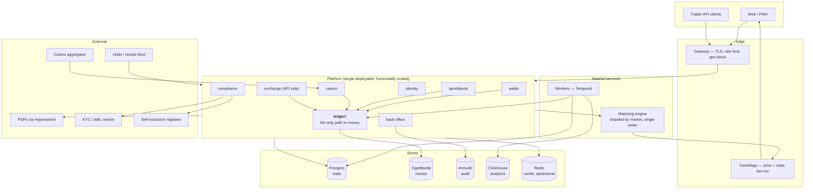
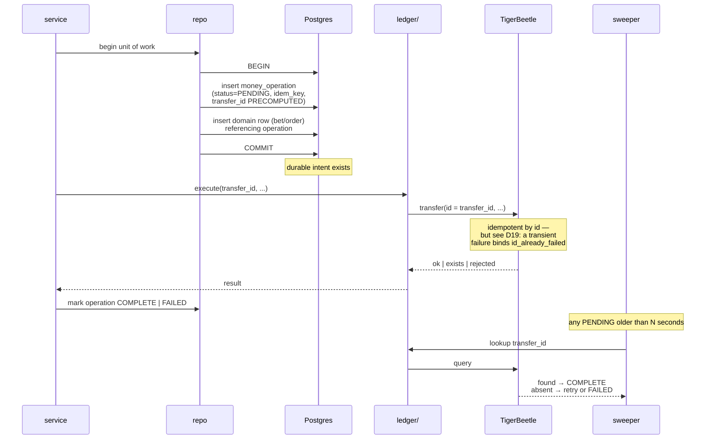
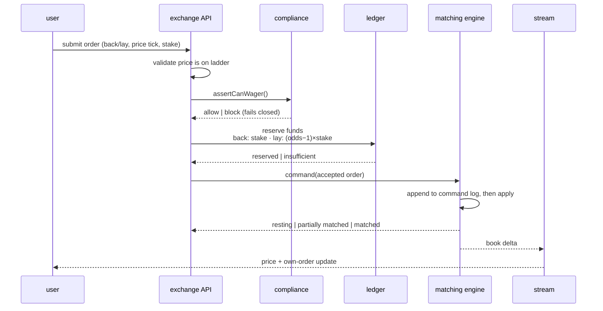
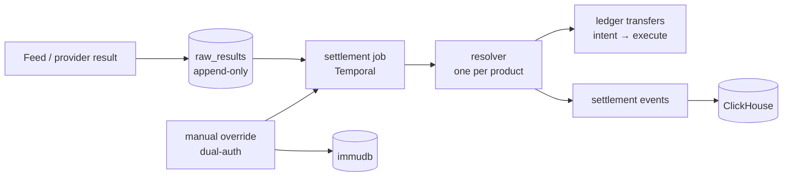

# ARCHITECTURE

How the system is put together and why. `PRD.md` is authoritative on *what*, `docs/DECISIONS.md`
on *why* at the decision level, `CLAUDE.md` on *how* we write code. This document is the shape.

Every invariant in `CLAUDE.md` §4 is a constraint on this design, not a suggestion the design
accommodates.

> **⚠️ Phase 1 (play-money cricket) uses a TRIMMED stack — D33.** The chip ledger is a **double-entry
> table in Postgres**, so the two-store money seam (§2), TigerBeetle, immudb, Temporal, Hyperswitch
> and the matching engine below are the **real-money design, superseded for Phase 1** and retained as
> reference. For what is actually built now, read `docs/CRICKET-MVP.md` + D32 + D33. The trimmed
> stack: **Postgres + Redis + Centrifugo + a job queue + lightweight auth.**

---

## 0. The shape

---

## 1. Topology, and why it is not microservices

**One deployable for the platform. One extracted stateful service. Workers alongside.**

The platform modules — identity, wallet, sportsbook, casino, exchange API, compliance,
back-office — ship as a single horizontally-scaled process. Module boundaries are real and
enforced by lint (`CLAUDE.md` §3.3, Workstream C1), not by network calls.

**Why not services per domain.** The failure mode is well documented in this team's own prior
work: 19 services communicating over synchronous HTTP with no queue, one service calling fifteen
others, and cross-database reads to fetch config. That is a distributed monolith — it pays the
full latency, debugging and deployment cost of distribution while retaining every coupling of a
monolith. The boundaries we need here are *compile-time* boundaries, and lint enforces those for
free.

**What is extracted, and why only this.** The matching engine runs as a separate process because
it is genuinely a different kind of thing:

- **Stateful** — the order book lives in memory; it is not a request/response handler.
- **Single-writer per market** — which is what makes partial-fill-versus-cancel races impossible
  rather than merely unlikely.
- **Latency-critical** — P99 < 150 ms end to end. It must not share a runtime with a KYC document
  upload or a PDF export.
- **Independently scalable** — sharded by market; the platform scales on request volume, the
  engine on market count and order rate.

Workers (Temporal) run separately for the same reason: settlement runs, payout approvals and
reconciliation are long, bursty, and must not compete with request handling.

**Extraction later is cheap and deliberate.** Modules already communicate through published
interfaces. If casino callback volume or back-office reporting ever justifies its own process,
the seam is already there. We are not paying for that possibility today.

---

## 2. The money seam — the most important section

Two stores hold one truth: **Postgres holds state, TigerBeetle holds money** (D5). The seam
between them is where this system is most likely to go wrong, so it gets one pattern used
everywhere, with no exceptions.

### 2.1 Dual-write is the failure mode

Writing to Postgres and TigerBeetle in sequence, hoping both land, produces the two failures that
matter: a bet recorded but unfunded, or funds moved with no record of why. Neither is detectable
without reconciliation, and both involve real customer money.

### 2.2 The pattern: intent → execute → confirm

> **Diagram corrected 2026-08-04.** The previous version showed `service` calling Postgres and
> TigerBeetle directly, which contradicted §2.3 (*"Nothing outside `ledger/` calls TigerBeetle"*),
> `CLAUDE.md` §3.3 (*"`repo.ts` — the only place that touches the database"*), and the lint rule
> `C1.3` in M0. A developer implementing this from the diagram would have had the PR rejected by
> the project's own CI, with the likely resolution being a lint exemption carved into the money
> path — precisely the boundary the rule exists to protect.

**Why this is safe.** The transfer ID is generated *before* the Postgres commit and stored with
the intent. TigerBeetle transfers are idempotent by ID, so the execute step can be retried
arbitrarily — by the caller, by a retry, or by the sweeper — and converge on one outcome. There is
no window in which a crash produces money without a record: the record is committed first, and the
money is deterministic from it.

**The sweeper is not a safety net, it is part of the design.** It runs continuously from
Workstream A5, not added later when breaks appear.

### 2.3 Rules that follow

- **Nothing outside `ledger/` calls TigerBeetle.** Enforced by lint (`CLAUDE.md` §3.3).
- **Every money operation carries an idempotency key** supplied by the caller, distinct from the
  transfer ID. Same key twice returns the first result (§5.6).
- **A balance is never read from Postgres.** Available balance is derived from ledger accounts.
  Postgres may cache a *display* balance; nothing may decide from it.
- **Reservations are ledger accounts, not columns.** A reserved balance is a real account with real
  transfers into it, so exposure is provable rather than computed.

---

## 3. The exchange

### 3.1 Order flow

**Reservation precedes the book** (D12). A resting unmatched order holds its reservation for as
long as it rests. On cancel, reject or void, the reservation is released through the same ledger
path that took it.

The inverse — match first, fund after — produces matched-but-unfunded orders. There is no
recovery from that: the counterparty has a legitimately matched bet.

### 3.2 Engine design

- **Sharded by market**, single writer per shard. Price-time priority within a runner's book.
- **Command-sourced.** Every accepted command is appended to a durable log *before* it is applied
  to the in-memory book. Restart replays the log. The book is a projection, never the record.
- **Deterministic.** Same command sequence produces the same book. No wall-clock reads, no random
  tiebreaks — sequence numbers order everything.
- **Suspension blocks matching, cancels nothing.** In-play incidents suspend instantly; resting
  orders survive.
- **Bet delay applies to in-play submission** (1–8 s by sport), implemented at the API boundary
  before the command is issued, not inside the engine.

### 3.3 Exposure

Exposure — worst-case P&L across every runner in a market — is computed by one function (§5.2)
used by the bet slip, the account screen, the pre-wager check and the risk console. Correctness
matters because these must agree; latency matters because it renders on every price tick.

It is a projection over the user's matched and unmatched positions, maintained incrementally and
recomputable from scratch. Never `.filter()` inside a loop over runners (`CLAUDE.md` §3.4) — that
is exactly the shape that goes O(n²) on a busy market.

---

## 4. The read path and the 20× spike

In-play traffic spikes twenty-fold at kick-off (`PRD.md` §12). The architecture assumes it.

- **Prices are pushed, never polled.** Matching engine and feed adapter emit deltas → fan-out →
  Centrifugo → WebSocket. Fifty thousand clients watching one market is one broadcast, not fifty
  thousand queries.
- **No hot-path query reaches Postgres for market state.** Market and price views are served from
  memory and Redis, rebuilt from the event stream.
- **Own-state is separate from market-state.** A user's orders and exposure stream on a
  per-user channel; the market book streams on a per-market channel. They scale differently.
- **Writes stay bounded.** Order submission is the only high-frequency write, and it is a single
  reservation plus a single command.
- **Analytics never touches the operational store.** ClickHouse is fed from the event stream and
  serves reporting, the RG behavioural model and regulatory exports.

---

## 5. Compliance in the hot path

Gates run before the action and **fail closed on error and timeout** (`CLAUDE.md` §4). That makes
their latency a product concern.

| Check | Freshness | Where |
|---|---|---|
| Jurisdiction config | Long TTL, versioned | In-memory |
| Account state | Per-request | Postgres, indexed |
| Limits (deposit/loss/session) | Per-action, authoritative | Ledger-derived |
| Self-exclusion — national register | At login and at deposit | External, cached to session with hard TTL |
| KYC tier | Per-request | Postgres |

**Cache miss plus provider unavailable equals block.** A gate that cannot verify does not allow
through and log. This is the one place where availability loses to correctness by design.

### 5.1 Revocation — sessions must be terminable

A gate on the next request is not sufficient. A user who self-excludes, is suspended, or hits a
limit may hold an open session with a live WebSocket and resting orders.

**Design requirement:** compliance state changes publish a revocation event that (a) terminates
the user's sessions, (b) closes their streams, and (c) cancels or freezes resting exchange orders
per the reason code. Blocking the next HTTP call is the last line, not the first.

This is the gap most easily missed, because everything looks correct in a request-scoped test.

---

## 6. Settlement

- **Raw results are stored as received**, append-only. Every settlement is recomputable from them.
- **Settlement is a job, never a request** — it is bursty, long, and must survive a restart
  mid-market.
- **Corrections are new compensating entries.** Nothing is updated, nothing is deleted.
- **Manual override requires dual authorisation** and writes an immutable audit record. The
  override is a recorded event that the resolver consumes, not an edit to a settled row.

---

## 7. Casino seamless wallet

Provider callbacks are the highest-volume money path and the one most likely to be built wrong.

- Callbacks land on a dedicated endpoint, sharing the ledger path (§2.2) with everything else.
  **There is no fast path that bypasses the ledger** — that shortcut is how operators end up
  unable to reconcile.
- **Idempotent by provider transaction ID.** Duplicate callbacks are routine traffic, not an
  exceptional case (D10). The second call returns the first result.
- Providers time out aggressively, so the path is short: validate → reserve/settle → respond.
  Anything slower goes to a worker and the callback returns the accepted state.
- Rollback is a first-class operation, not a compensating hack.

---

## 8. Where data lives

| Store | Holds | Notes |
|---|---|---|
| **Postgres** | Users, accounts, bets, orders, markets, KYC records, money-operation intents | The state of the world. Never authoritative on a balance |
| **TigerBeetle** | All funds, all reservations, all commissions | Authoritative on money. Append-only, double-entry, balanced |
| **immudb** | Back-office actions, compliance decisions, overrides | Tamper-evident. Written through one wrapper (C4) |
| **ClickHouse** | Bet/market events, behavioural data, reporting | Fed from the event stream. Never queried in a hot path |
| **Redis** | Sessions, gate caches, market projections | Ephemeral by definition. Nothing is only in Redis |
| **Command log** | Matching engine commands | Durable, replayable, per shard |

---

## 9. Failure modes and intended behaviour

| Failure | Behaviour |
|---|---|
| TigerBeetle unavailable | **Resolved (D29).** Money-*committing* paths (wagers, casino debits, withdrawal reservation) are synchronous and **halt** — no bet accepted. Money-*in* paths (deposits) use intent-then-execute and complete via the sweeper. A leader election is ~90s of refused bets; accepted, and no path accepts an unfunded bet to preserve uptime |
| Matching engine shard down | That market suspends. Sportsbook and casino unaffected |
| Matching engine restart | Replays command log; book rebuilt. Reservations are durable because they are **posted transfers into the `reserved` account with `timeout = 0`** (D28) — no silent expiry |
| Feed down | Affected markets go unavailable and accept no bets. **No fabricated prices** (`CLAUDE.md` §3.10) |
| Self-exclusion register unreachable | Deposit and login blocked for affected users. Fails closed |
| Provider callback duplicated | No-op returning the first result — **provided `money_operation` carries a UNIQUE constraint on the caller idempotency key** (`MILESTONES.md` A4.1). Without it, two nodes mint two transfer IDs and debit twice, and the ledger still balances |
| Provider callback during our outage | Provider retries; idempotency makes replay safe |
| Postgres commit succeeds, TigerBeetle call lost | Sweeper completes it. On a *transient* failure the operation retries with a **fresh transfer id** — never the poisoned one (`id_already_failed` is permanent, D19 quote 7). Id strategy is A4.5 (D28) |
| Settlement arrives twice | Idempotent by result ID; second is a no-op |
| Partial fill races a cancel *(exchange only)* | **Phase-2 concern (§12 item 4, deferred).** Does not arise in the cricket MVP — operator-priced betting has no order book. For the exchange, the release amount must be a value the engine *returns*, not derived from a read model |

---

## 10. Deliberately not doing yet

Named so they are decisions rather than omissions:

- **Kafka.** Postgres-backed outbox plus Redis/NATS fan-out covers Phase 1 volume. Kafka arrives
  when analytics or cross-service event volume justifies the operational weight — not before.
- **Per-domain services.** §1. The seams exist; extraction is deferred until measured need.
- **Multi-region.** Single region until a second jurisdiction requires data residency (D13).
- **A JVM or Rust matching engine.** D6 is **confirmed** (D27): TypeScript behind a narrow interface,
  replaced only if measured load demands it.
- **Read replicas for the operational store.** ClickHouse absorbs analytics; replicas are premature
  until a measured read problem exists.

---

## 11. How this satisfies the invariants

| `CLAUDE.md` §4 invariant | Where |
|---|---|
| The ledger is the only money | §2.3 — nothing outside `ledger/` reaches TigerBeetle; balances derived, never stored |
| State and money in one direction | §2.2 — intent → execute → confirm, with a sweeper |
| Every money operation idempotent | §2.2, §7 — caller key plus precomputed transfer ID |
| No credit, ever (no *wager* path goes negative — D31) | §3.1 — reservation precedes the book; insufficient funds rejects at submission |
| Compliance gates fail closed | §5 — cache miss plus provider down equals block |
| Self-exclusion has no override | §5.1 — plus revocation terminates live sessions |
| Reservation precedes exposure | §3.1 |
| Settlement append-only and replayable | §6 — raw results stored; corrections compensate |
| Feed proposes, platform disposes | §6, §7 — external input produces validated events, never direct mutation |
| Jurisdiction is configuration | §5 — resolved config, no branches |
| Slow work in a table | §6 — Temporal jobs |
| Back-office attributable and immutable | §8 — immudb through one wrapper |

---

## 12. Architectural decisions — the M1-gating four are signed off

Surfaced by the 2026-08-04 review. **The four M1-gating items (1, 2, 3a, 8) were signed off on
2026-08-04 — D28–D31 — and D6 confirmed (D27).** Items 4 and 6 are exchange-only and stay deferred
to Phase 2; item 7 is blocked on GGL verification; item 5 was withdrawn to the compliance cycle.

| # | Decision | Status | Blocks |
|---|---|---|---|
| **1** | **Reservation mechanism.** Two-phase pending transfers cannot survive partial fills (D19). Recommended: posted transfers cash→`reserved`, one `reserved` account per user, attribution in Postgres, guarded by the invariant `sum(open reservations) == reserved balance`. | **Signed off — D28** | A3.2, A3.3 |
| **2** | **Sync vs async money paths.** §2.2, §3.1 and §9 currently give three incompatible readings of TigerBeetle-down behaviour. Proposed rule: **synchronous wherever insufficient funds must block the action; asynchronous everywhere else.** Wagers, casino debits and withdrawal *reservation* are synchronous; deposits, withdrawal *execution*, settlement and commission are not. Consequence to state explicitly: synchronous paths bound platform availability to TigerBeetle availability — a leader election is ~90s of refused bets. | **Signed off — D29** | §9, D17 |
| **3** | **Currency.** **Now primary-verified (D19 quote 5):** TigerBeetle's `ledger` field *"partitions the sets of accounts that can transact with each other"* and must match on **both** accounts in a transfer — so **cross-currency transfers are impossible**, and a EUR user can never match against a SEK user in one book. *Two questions follow.* (a) Encoding currency in the ledger/account-ID scheme is **unretrofittable and must be settled before M1** (D5). (b) Whether the book partitions per currency, or runs a single settlement currency with wallet-level FX, is deferrable to Phase 2 — but it directly worsens the liquidity problem that already gates the exchange (D11), so weigh it when the exchange business case is revisited. | **(a) signed off — D30** · (b) deferred | A3.1 |
| **4** | **Cancel-ack becomes money-authoritative.** The release amount must be a value the matching engine *returns*, never derived from a read model — §9's single-writer claim only orders events inside the engine, while the release is issued from the platform process. Widens the engine interface. Failure direction is safe (over-holding). | Recommended, unsigned | Phase 2, N |
| **5** | *(Withdrawn — moved to the later compliance cycle.)* | — | — |
| **6** | **Gross vs net reservation.** Gross recommended at launch: netting collapses when one leg of a matched position is voided, and void semantics are themselves unspecified. Display both figures with distinct labels rather than one ambiguous number. Netting is a Phase 3 optimisation contingent on void semantics first. | Recommended, unsigned | Phase 2, O |
| **7** | **Precomputed player-tier projection** for the German behavioural qualification — a 90-day query cannot sit in the casino callback path. Decreases apply immediately via the D18 revocation channel; increases on scheduled recalculation. | Blocked on GGL primary verification | WD1, M3 |
| **8** | **Chargebacks.** Needs a house dispute-suspense account, a `reverse` primitive, and a user state carrying outstanding debt. `CLAUDE.md` §4's invariant must be rescoped to **"no *wager* path permits a negative available balance"** — as written it is false the first time a chargeback lands, and would fail A1.4 in CI on a real production event. | **Signed off — D31** | A3.2, A3.3 |

**Settled 2026-08-04 (D28–D31)** — items 1, 2, 3(a), 8, the four that gated M1. All ledger-shaped;
D5 made them the point of no return, so they were resolved before A3. **M1 is unblocked.**

**Deferred to Phase 2 exchange scoping** — 1(partial-fill capture mechanics), 3(b), 4, 6.
