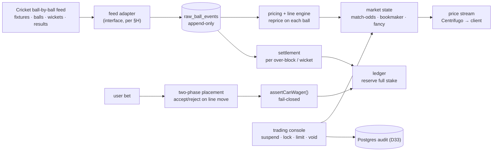

# CRICKET MVP — Phase 1 execution spec

Self-contained plan, architecture and milestones for the **cricket-only** first build. Reads on top
of the shared documents; it does not replace them. `PRD.md` is authoritative on the product,
`CLAUDE.md` on how we write code, `docs/ARCHITECTURE.md` on the platform shape, `docs/DECISIONS.md`
on why.

| | |
|---|---|
| Scope | Cricket betting, operator-priced. One sport, one engine |
| Chosen | 2026-08-04 — client narrowed Phase 1 to cricket (answers `PRD.md` §16 Q3). See **D24**, **D25** |
| Reference | The market surface mirrors the Indian reference platforms' cricket product (`PRD.md` §5.2–5.3) |
| Jurisdiction | **Not a Tech concern** (client-owned, per Appendix A.5). Under D32 (play-money) market legality is largely moot anyway; the config switches remain but are not load-bearing |
| **Money** | **Play-money only, forever (D32).** Virtual chips, no cash value, no deposits/withdrawals. No KYC, no real payments, no chargebacks, no gambling licence |

---

## 0. What this is

**Cricket betting where the operator is the book.** Three market groups, all operator-priced:
**match-odds**, **bookmaker**, and **fancy/session**. The user bets, the platform is the
counterparty, the platform carries the risk and takes the margin.

### 0.1 The insight that makes this the right first slice

The Indian reference sites present match-odds as a Betfair-style exchange — but that half is a
pass-through to Betfair's liquidity, which is **not licensable to resell** under an EU licence, and
building our own exchange is the part with the liquidity-bootstrap problem that gates all of Phase 2
(D11). **The bookmaker and fancy markets — which are the bulk of actual cricket volume — are
operator-priced and need no order book, no matching engine and no liquidity.**

So the cricket MVP is a **fixed-odds sportsbook specialised for cricket**. It:

- **Sidesteps D11** — the single largest risk in the whole programme. No market-maker required.
- **Exercises the money core in its *simple* mode** (§2.2) — full-stake reservation, no partial
  fills — so it can proceed while the exchange's reservation complexity (§12 item 1) stays open.
- **Defers** the true exchange (Phase 2, N–R) and the casino (M9) entirely.

### 0.2 In scope / out of scope

| In | Out (deferred) |
|---|---|
| Match-odds, bookmaker, fancy/session — operator-priced | The true back/lay **exchange** / order book (Phase 2) |
| Cricket ball-by-ball feed ingestion + settlement | Casino / live casino (general M9) |
| Operator pricing, risk controls, market locks | All non-cricket sports |
| In-play suspension, repricing, per-session settlement | Betfair-liquidity resale (not licensable) |
| Trading console + integrity flags for cricket | Bonusing / affiliates (unscheduled; `PRD.md` §11.12) |

### 0.3 The real-money launch blockers are gone (D32)

Under **D32 (play-money only)** there is **no real-money go-live**, so **M5 (KYC/AML), M6 (statutory
RG), M7 (payments) and licensing are all out of scope.** The cricket engine on a chip ledger *is* the
product — there is no separate real-money track to reach. Lightweight healthy-play features may still
be desirable UX, but they are not the statutory RG regime.

---

## 1. Mapping to the existing docs

**Reused unchanged** — the cricket MVP builds *on top of* these, it does not re-spec them:

| Shared | Role in cricket MVP |
|---|---|
| **M0** scaffold, **M1** money core | The **Postgres chip ledger** (D33), chip type, reservation. Cricket uses the single-transaction path (§2.2) |
| **M2** identity + fail-closed gates | `assertCanWager()` runs before every cricket bet |
| **M3** / Workstream D — jurisdiction config | **Cricket market types are config entries here.** The client's enable/limit/lock switches live in this schema |
| ~~M5 KYC · M6 RG · M7 payments~~ | **Out of scope (D32)** — no real money, no launch blockers |
| Back-office audit wrapper (C4) | Every trading action writes through it — to an append-only **Postgres** audit table (D33), not immudb |
| `CLAUDE.md` §3.1 sportsbook scaled-integer prices | Cricket prices are decimals (e.g. 1.90) — scaled integers, **not** exchange ladder ticks (A2.4) |
| `CLAUDE.md` §5 rules 2 & 11 | `calculateCustomerExposure()` and `calculateOperatorLiability()` — both used, and distinct |

**New for cricket** — everything in §4–§5 below.

---

## 2. Architecture

### 2.1 The shape



### 2.2 The money model is the *simple* one — this is the crux

> **Under D32 these are *virtual chips*, not money.** The reservation mechanics below are unchanged
> (you still can't stake chips you don't have), but **D31/chargebacks is void** (no real payments)
> and **D30 collapses to a single chip currency**. The correctness bar is game integrity — no chip
> duplication or loss — not financial audit.

Operator-priced betting has **no order book, no resting orders and no partial fills.** A bet is
accepted in full at a price, or rejected. That makes the reservation trivial compared to the
exchange:

- **Back bet** (user backs an outcome): reserve **stake**.
- **Lay / "No" bet** (user bets against): reserve **liability = (odds − 1) × stake**.

Either way the amount is **known and fixed at placement**. Under **D33** the whole thing is a
**single Postgres transaction**: debit `user_chips`, credit `user_reserved`, insert the bet — atomic,
so a bet can never be recorded-but-unfunded, and `no negative chip balance` is a check inside that
transaction. Settlement is another transaction:

- **Win:** `reserved → user_chips` (stake back) **+** `house → user_chips` (winnings).
- **Loss:** `reserved → house`.

**None of the two-store machinery applies.** No TigerBeetle, no intent-then-execute, no sweeper, no
cross-store reconciliation, no transfer-id poisoning — those were D17/§12 concerns for the real-money
*two-store* design, and D33 collapsed them into one ACID transaction. Double-entry is kept as
discipline (every movement balanced, append-only) to keep the chip economy honest, not because a
regulator needs it.

**What the former §12 money items reduce to under D32/D33:**

| Item | Under play-money, one store |
|---|---|
| Reservation (1) | A debit/credit pair in one transaction. The exchange's partial-fill problem never arises — operator-priced, no order book |
| Sync vs async (2) | Moot — one local transaction; nothing to sequence across stores |
| Currency (3a) | One chip currency (D30 collapsed) |
| Chargebacks (8) | Void — no real payments (D31) |

### 2.3 Cricket domain model

```
Sport(cricket) → Competition → Match → Innings → Over → Ball        (the event stream)
Match → Market(match-odds | bookmaker | fancy-template)
FancyMarket → Line(value, yesPrice, noPrice)                         (repriced every ball)
Bet → (market, selection, lineValueAtPlacement, priceAtPlacement, stake, status)
```

**This internal schema is the contract every feed adapter maps into** — validated against the
observed top5050 structure (`event`, `fancy[]`, `market[]`, from the 2026-08-04 HAR capture). Dev
code depends on this schema, never on a provider's raw payload (D26).

Bet lifecycle (operator-priced — reuses the sportsbook state machine, `PRD.md` §11.4, **not** the
exchange order lifecycle):

```
SUBMITTED → PRICE_CHECK → ACCEPTED | REJECTED → OPEN → SETTLED (WON|LOST|VOID) | CASHED_OUT
```

### 2.4 The feed is the settlement source of truth

Cricket settlement is **driven by ball-level events**, not a single end-of-event result. This is the
defining technical dependency and the defining risk.

- **Ball-by-ball granularity is mandatory.** Session markets settle per over-block; "next wicket"
  settles per wicket. A feed that only gives score summaries cannot settle them. **Not every cricket
  feed provides ball resolution** — this is a specific vendor requirement, distinct from a general
  Sportradar/Betgenius deal.
- **Raw ball events are stored append-only** (`raw_ball_events`), exactly as `ARCHITECTURE.md` §6
  requires for results. Every settlement is recomputable from them.
- **Corrections happen** — third-umpire reversals, mis-signalled boundaries, no-balls called late.
  Settlement must **resettle via compensating entries** under dual authorisation (K), never edit.
- **Feed down = markets suspended, no fabricated prices** (`CLAUDE.md` §3.10). A cricket book that
  invents a line during a feed gap is mispricing live liability.

**Provider strategy — demo vs prod (D26).** The source is environment-configured and pluggable:

- **Demo / dev:** `cricbuzz11.in` or recorded fixtures — play-money, so the accountability bar does
  not apply.
- **Prod (real money):** a contracted, identifiable provider with an SLA (**SportMonks** / CricketData
  to trial — C-b). A **boot tripwire refuses to start prod on a demo source** (`CLAUDE.md` §3.11).
- **The adapter maps every source into the internal schema (§2.3)** — dev never couples to a
  provider's raw shape, so the prod swap is a new adapter, not a rewrite.
- `cricbuzz11.in` is a third-party endpoint likely referrer/token-gated; server-side pulls may be
  blocked, so **recorded fixtures are the fallback and the CI source** regardless.

### 2.5 In-play: suspension, repricing, bet delay

Every ball changes the state. The engine must:

- **Suspend on each delivery** — block acceptance the instant a ball is bowled; reprice on the
  outcome; reopen. Wickets and boundaries move session lines sharply.
- **Apply a bet delay** on acceptance (anti-courtsiding). The reference platforms expose this
  per market type — observed field names `bookmaker_delay`, `fancy_delay`, `fancy_run_delay`
  (from the public bundle, 2026-08-04). Ours is configurable per market type in the same way.
- **Two-phase placement** — validate the user's bet against the *current* line and reject if it has
  moved beyond tolerance (`PRD.md` §11.4 `PRICE_CHECK`).

### 2.6 Operator risk controls — grounded in the observed control surface

Because the operator carries book risk on the highest-integrity-risk markets in sport, the risk
layer is **not optional and ships early**. The required control surface is directly evidenced by the
reference platform's own client bundle (public assets, fetched 2026-08-04) — these are the exact
levers a cricket book needs:

| Observed field | Control it implements |
|---|---|
| `bookmaker_stack`, `fancy_stack` | Max stake per bet, per market type |
| `fancy_session_th` | Session-market exposure threshold |
| `bookmaker_delay`, `fancy_delay`, `fancy_run_delay` | Bet-acceptance delay, per market type |
| `FancyBetLock` | Lock a single fancy market |
| `FancySectionLock` | Lock the entire fancy section at once |
| `fancy_type`, `bookmaker_type` | Market-type classification for config |

Plus, ours adds what a licensed book requires and the reference lacks: **per-market liability caps
with auto-suspend on breach**, **per-user stake factoring**, and **integrity flags** on session
markets (the spot-fixing surface — `PRD.md` §5.3).

---

## 3. Market taxonomy and settlement

| Group | Mechanic | Priced | Settles from | Notes |
|---|---|---|---|---|
| **Match-odds** | Match winner, back/lay, operator-priced | Operator (MVP) | Match result | Exchange version is Phase 2; MVP prices it as the book |
| **Bookmaker** | Operator match/sub markets — toss, completed-match, innings runs | Operator | Result / innings end | The margin engine |
| **Fancy / Session** | Two-sided Yes/No lines on micro-events | Operator | **Ball events** | The bulk of volume and the integrity-sensitive set |

**Fancy/session sub-types** (built as configurable market templates; the client enables per market):

- **Session runs** — runs in the first *N* overs (6/10/15/20). Settles at over-block completion.
- **Batsman runs** — over/under a line for a named batter. Settles on dismissal or innings end.
- **Fall of next wicket** — runs at next wicket. Settles per wicket.
- **Total innings runs (lambi)** — full-innings line. Settles at innings end.
- **Over runs**, **boundaries/sixes count**, **method of dismissal** — per the reference taxonomy.

**Settlement is a stream of micro-settlements**, triggered by feed events — not one end-of-match job.
Over completion settles that block's session markets; a wicket settles next-wicket markets; innings
end settles lambi and batsman lines; match end settles match-odds and bookmaker.

---

## 4. Workstreams

### Prerequisites (shared, from the general plan)

`M0` scaffold · `M1` money core (simple reservation path) · `M2` identity + gates · `M3` jurisdiction
config incl. **cricket market-type schema** · and for real-money: `M5` KYC · `M6` RG · `M7` payments.

### Cricket-specific

| Code | Workstream | Depends on |
|---|---|---|
| **XC1** | Cricket feed adapter — fixtures, ball-by-ball, scorecard, results; append-only `raw_ball_events`; maps every source into the internal schema | M0. **Demo:** cricbuzz11/fixtures, no contract · **Prod:** contracted provider (D26, C-b) |
| **XC2** | Market model + pricing/line engine — templates, operator pricing, per-ball repricing | M1, XC1 |
| **XC3** | Placement + operator risk — two-phase placement, full-stake reservation, exposure/liability, delays, locks, caps, auto-suspend | M1, M2, XC2 |
| **XC4** | In-play settlement — per over-block / per wicket, append-only, replayable, dual-auth resettle | XC1, XC3 |
| **XC5** | Trading console (cricket) + integrity flags — suspend/lock/void/resettle, stake factoring, exposure by match/market | C4, XC3 |

---

## 5. Milestones

Each ends in a demonstrable proof (`MILESTONES.md` convention). Prefix **CM** = cricket milestone,
distinct from the general `M`-series.

### CM1 — Cricket feed is live · **L**
> **Proof:** a real match's ball-by-ball stream flows into `raw_ball_events`; an induced feed outage
> suspends all cricket markets with **no fabricated prices**; the stored events replay to the same
> state; and **prod config refuses to boot on a demo feed source** (D26).

`XC1.1` adapter behind the feed interface (Liskov-substitutable) · `XC1.2` fixtures + catalogue ·
`XC1.3` ball/wicket/over event ingestion · `XC1.4` scorecard + results · `XC1.5` append-only store ·
`XC1.6` feed-down → suspended, bets refused · `XC1.7` map source → internal schema (§2.3) · `XC1.8`
env-config source selection + prod boot tripwire (D26) · `XC1.9` recorded-fixture replay source for CI.

### CM2 — Markets priced and repricing live · **L**
> **Proof:** a match shows all three groups; session lines reprice on every ball from the feed; a
> market can be enabled/disabled and stake-limited purely via config, no deploy.

`XC2.1` market templates (match-odds/bookmaker/fancy sub-types) · `XC2.2` operator pricing (manual +
feed-derived) · `XC2.3` per-ball line repricing · `XC2.4` market-type config: enable/disable, stack,
delay, session threshold (the §2.6 surface) · `XC2.5` prices as scaled integers (A2.4), never ladder
ticks.

### CM3 — A bet placed against live funds, with the book protected · **XL**
> **Proof:** a fancy bet is placed against a live line and the **full stake reserves** in the ledger;
> a market breaching its liability cap **auto-suspends**; a locked market rejects bets; a moved line
> rejects on price-check; `calculateCustomerExposure()` on the bet slip agrees with the risk console.

`XC3.1` two-phase placement (accept/reject on move) · `XC3.2` full-stake reservation `chips→reserved`
(§2.2) · `XC3.3` `calculateCustomerExposure()` + `calculateOperatorLiability()` · `XC3.4` bet delay ·
`XC3.5` `FancyBetLock` / `FancySectionLock` · `XC3.6` per-market liability cap + auto-suspend ·
`XC3.7` per-user stake factoring · idempotent by placement key.

### CM4 — In-play settlement, replayable · **XL**
> **Proof:** a session market settles correctly at over-block completion **from stored ball events**;
> a simulated third-umpire correction **resettles via compensating entries** under dual auth; a
> replay from `raw_ball_events` reproduces identical ledger effects.

`XC4.1` micro-settlement triggers (over-block, wicket, innings, match) · `XC4.2` resolver per market
group · `XC4.3` void rules (abandonment, no-result) · `XC4.4` compensating-entry resettlement ·
`XC4.5` dual-auth manual override → append-only Postgres audit (D33).

### CM5 — Trading console + integrity · **L**
> **Proof:** an operator suspends a market, voids a bet and resettles through the console — every
> action in the immutable audit log with operator, timestamp, before/after; SoD enforced (adjuster ≠
> approver); session-market integrity flags surface for review.

`XC5.1` exposure by match/market/user · `XC5.2` suspend/lock/void/resettle (dual-auth) · `XC5.3`
stake factoring · `XC5.4` integrity flags on session patterns · `XC5.5` all actions via the C4
wrapper.

### CM6 — Cricket end-to-end · **L** — *the playable-product proof*
> **Proof:** a player with chips → cricket match → bets on match-odds, bookmaker **and** a session
> market → ball-by-ball settlement → chip-ledger movement → correct balance. Includes a void and a
> resettlement. The full play-money path, end to end — a playable product.

Integration milestone over CM1–CM5. (No M5/M6/M7 under D32.)

---

## 6. Critical path & dependencies

```
M0 → M1 ─┬─────────────► XC1 → XC2 → XC3 → XC4 → CM6
         │  (cricket)                              ▲
M2 ──────┤                          XC5 ───────────┘
```

**Longest chain:** M0 → M1 → XC1 → XC2 → XC3 → XC4 → CM6. XC5 runs alongside. **No real-money track**
under D32 — there is no M5/M6/M7 to run in parallel, and CM6 is a *playable product*, not a
pre-launch gate.

**External dependencies — flag with owners at kickoff:**

- **Cricket ball-by-ball feed** — **no contract required under D32** (no money settles, so cricbuzz11
  or any cheap source is fine, even in production; D26's demo-vs-prod split and boot tripwire are
  moot). Ball-level coverage of the target competitions is still the practical requirement — pick a
  source with good coverage and reasonable reliability.
- The §12 sign-offs are done (D28–D31); D31/chargebacks is void under D32. Nothing architectural
  gates M1 now.

---

## 7. Open decisions specific to cricket

| # | Decision | Recommendation |
|---|---|---|
| C-a | **Match-odds: operator-priced or true exchange for MVP?** | **Operator-priced.** Keeps the whole MVP off the order book and off D11. Add the exchange in Phase 2 |
| C-b | **Feed vendor** | **Resolved (D26).** Demo = cricbuzz11/fixtures. Prod = contracted provider: **SportMonks** primary candidate (€29–129/mo, EU, ball-by-ball, verified) or CricketData.org; premium only if SLA/rights demand. Final prod pick still to trial against latency, correction handling, competition coverage |
| C-c | **Pricing: build vs licence** | Licence a cricket pricing/model feed initially; do not build a cricket model from scratch (`PRD.md` §9.2 non-goal) |
| C-d | **Feed redundancy** | A single feed is a single point of settlement truth. Decide whether a second source cross-checks before it drives money |

---

## 8. Tech builds vs client owns

Per the client's instruction (2026-08-04) and Appendix A.5:

- **Tech builds:** every cricket market type; the enable/disable/stake-limit/delay/lock config
  surface; per-market liability caps; integrity flags; the trading console. The *capability* and the
  *switches*.
- **Client owns:** which markets are switched on in which licensed market, and the legality of any
  given fancy market. Set in the jurisdiction config (WD1); no code change.

This keeps the compliance gate real (the switches exist and default off) without making legality a
Tech blocker.

---

## 9. Assumptions & evidence

1. **Operator-priced** cricket is the MVP; the true exchange is deferred (D24, D25).
2. Match surface and control fields are grounded in the reference platforms' **public** cricket
   product (`PRD.md` §5.2–5.3) and the top5050 client bundle fetched unauthenticated on 2026-08-04
   (§2.6). No authenticated session was used.
3. **Play-money only, forever (D32)** — no real money in or out. M5/M6/M7 and licensing are out of
   scope; CM6 is a playable product, not a pre-launch gate.
4. A cricket **ball-by-ball** feed is available. Since no money settles (D32), no contract or
   accountability bar applies; **unverified** which source best covers the target competitions at
   ball resolution — a practical pick, not assumed.
5. Jurisdiction/legality is **out of Tech scope** (client-owned) — and largely moot under D32, since
   play-money cricket is not gambling in the licensing sense.
